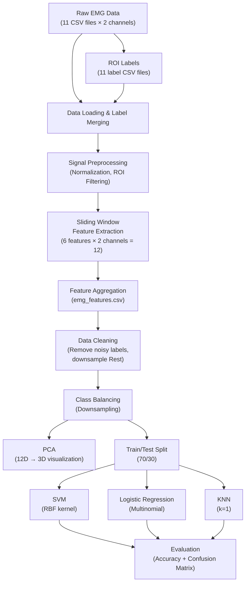
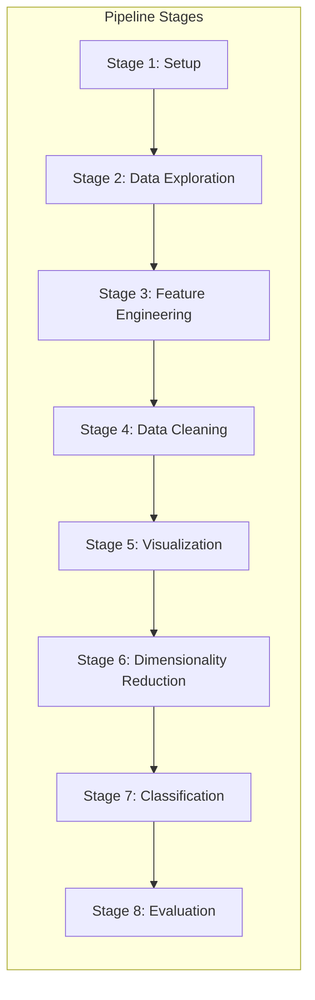
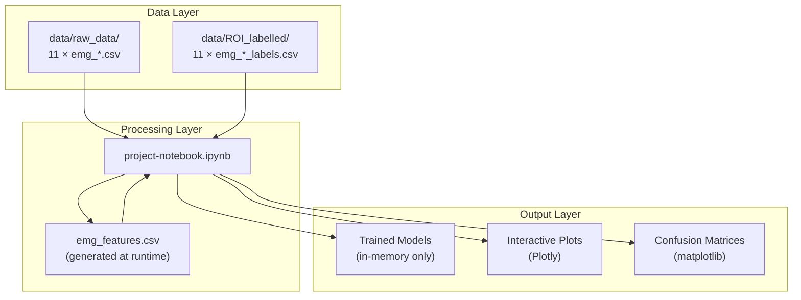
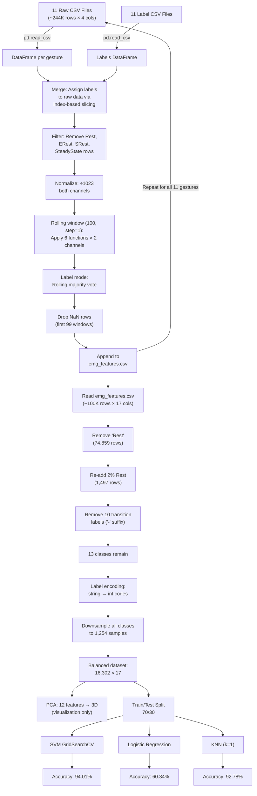

# Electromyography (EMG) Gesture Recognition — Comprehensive Technical Documentation

---

## Table of Contents

1. [Project Overview](#1-project-overview)
2. [Tech Stack & Dependencies](#2-tech-stack--dependencies)
3. [Architecture & Design](#3-architecture--design)
4. [Module / File Breakdown](#4-module--file-breakdown)
5. [Data Models & Schemas](#5-data-models--schemas)
6. [Algorithms & Logic](#6-algorithms--logic)
7. [Numbers & Parameters](#7-numbers--parameters)
8. [API & Interfaces](#8-api--interfaces)
9. [State Management & Data Flow](#9-state-management--data-flow)
10. [Edge Cases & Error Handling](#10-edge-cases--error-handling)
11. [Testing](#11-testing)
12. [Deployment & Configuration](#12-deployment--configuration)
13. [Known Patterns & Anti-patterns](#13-known-patterns--anti-patterns)
14. [Glossary](#14-glossary)

---

## 1. Project Overview

### 1.1 Purpose

This project implements an **end-to-end machine learning pipeline** for classifying hand gestures from surface Electromyography (sEMG) signals. Two EMG sensor channels record forearm muscle electrical activity while a subject performs 11 distinct hand gestures. The pipeline processes raw EMG recordings through feature extraction, data cleaning, dimensionality reduction, and multi-class classification using three supervised learning algorithms.

### 1.2 Goals

| Goal | Description |
|------|-------------|
| **Signal Processing** | Convert raw 10 kHz dual-channel EMG time-series into discriminative time-domain features using sliding-window extraction |
| **Gesture Classification** | Classify 13 gesture classes (11 active gestures + "paper"/"rock" from hand-open + downsampled "Rest") with high accuracy |
| **Model Comparison** | Benchmark three classifiers — SVM, Logistic Regression, and KNN — to determine the optimal algorithm for EMG gesture recognition |
| **Exploratory Analysis** | Visualize raw signals, feature distributions, and PCA projections to understand class separability |

### 1.3 High-Level Architecture



### 1.4 Recorded Results Summary

| Model | Train Accuracy | Test Accuracy |
|-------|---------------|---------------|
| **SVM (RBF, C=20, γ=1)** | **99.86%** | **94.01%** |
| Logistic Regression (C=0.1) | 60.74% | 60.34% |
| KNN (k=1) | 100.00% | 92.78% |

---

## 2. Tech Stack & Dependencies

### 2.1 Runtime Environment

| Component | Value | Notes |
|-----------|-------|-------|
| **Language** | Python 3.8.10 | Specified in notebook metadata (`language_info.version`) |
| **Notebook Format** | Jupyter Notebook v4.2 | `nbformat: 4`, `nbformat_minor: 2` |
| **Kernel** | `.venv` (Python 3) | Custom virtual environment named `.venv` |

### 2.2 Python Libraries

| Library | Version | Purpose | Why It's Used |
|---------|---------|---------|---------------|
| **pandas** | ≥1.3 (required for `step` param in `.rolling()`) | DataFrame manipulation, CSV I/O, rolling-window operations | Core data structure for tabular EMG data; `rolling(step=...)` enables efficient strided feature extraction |
| **numpy** | Any recent | Numerical computing | Vectorized array operations for all feature functions (RMS, MAV, WL, SSC, VAR, ZC) |
| **plotly** | ≥5.0 | Interactive visualization | `plotly.express` provides interactive scatter plots, 3D PCA visualization, and line plots for signal inspection |
| **scikit-learn** | ≥1.0 | Machine learning | Provides `PCA`, `SVC`, `LogisticRegression`, `KNeighborsClassifier`, `GridSearchCV`, `train_test_split`, `accuracy_score`, `confusion_matrix`, `ConfusionMatrixDisplay` |
| **os** | stdlib | File system operations | Checking file existence, removing stale `emg_features.csv` before regeneration |

### 2.3 Installation

Cell 0 of the notebook runs:
```bash
!pip install pandas numpy plotly
```

> [!NOTE]
> `scikit-learn` is **not** listed in the pip install command but is imported starting at Cell 33. This is a missing dependency in the installation step — it must be installed separately via `pip install scikit-learn`.

### 2.4 Implicit Dependencies

- **R / RStudio**: The presence of [.Rhistory](file:///Users/anuj/Downloads/EMG-Gesture-Recognition-main/.Rhistory) (an empty file) suggests the project directory was at some point opened in RStudio, likely for the data labeling/annotation phase that produced the ROI label files. No R code remains in the project.
- **EMG_Report_1.pdf**: A 839 KB PDF report, likely a companion academic/project report describing the experimental setup, sensor placement, and data collection protocol.

---

## 3. Architecture & Design

### 3.1 System Design Pattern

The project follows a **linear pipeline architecture** implemented as a sequential Jupyter notebook. There is no modularization into separate Python files, no package structure, and no object-oriented design. The entire pipeline is a single notebook ([project-notebook.ipynb](file:///Users/anuj/Downloads/EMG-Gesture-Recognition-main/project-notebook.ipynb)) with 56 cells executed top-to-bottom.



### 3.2 Design Decisions

| Decision | Rationale |
|----------|-----------|
| **Single notebook** | Enables iterative exploration; all state is in-memory across cells |
| **Intermediate CSV output** | `emg_features.csv` acts as a checkpoint so feature extraction (slow) doesn't need to be re-run |
| **Sliding window features** | Time-domain features computed over windowed segments are standard in sEMG analysis; they capture local statistical properties of the signal |
| **Min-max to [0, 1] normalization** | ADC values (0–1023) are scaled by dividing by 1023, mapping to [0, 1] |
| **Downsampling for class balance** | Prevents majority-class bias in classifiers; all classes are reduced to the size of the smallest class |
| **GridSearchCV for SVM** | Systematic hyperparameter optimization with 5-fold cross-validation |

### 3.3 Component Relationships



---

## 4. Module / File Breakdown

### 4.1 Complete File Inventory

| File | Type | Size | Purpose |
|------|------|------|---------|
| [project-notebook.ipynb](file:///Users/anuj/Downloads/EMG-Gesture-Recognition-main/project-notebook.ipynb) | Jupyter Notebook | 8.04 MB | **Main codebase** — all source code, 56 cells (42 code + 14 markdown) |
| [README.md](file:///Users/anuj/Downloads/EMG-Gesture-Recognition-main/README.md) | Markdown | 42 B | Single-line project title: "# Electromyography-EMG-Gesture-Recognition" |
| [.Rhistory](file:///Users/anuj/Downloads/EMG-Gesture-Recognition-main/.Rhistory) | R history | 0 B | Empty; artifact from RStudio usage |
| [EMG_Report_1.pdf](file:///Users/anuj/Downloads/EMG-Gesture-Recognition-main/EMG_Report_1.pdf) | PDF | 840 KB | Academic/project report document |
| `data/raw_data/emg_*.csv` (×11) | CSV | 608 KB – 881 KB each | Raw EMG recordings (see §5.1) |
| `data/ROI_labelled/emg_*_labels.csv` (×11) | CSV | 539 B – 1.2 KB each | Region-of-Interest labels (see §5.2) |

### 4.2 Notebook Cell-by-Cell Breakdown

Below is every cell in the notebook with its purpose, logic, and connections:

---

#### Cell 0 — Dependency Installation
```python
!pip install pandas numpy plotly
```
- **Purpose**: Install required Python packages
- **Issue**: Missing `scikit-learn`

---

#### Cell 1 — Library Imports
```python
import pandas as pd
import numpy as np
import os
import plotly.express as px
```
- **Purpose**: Import core libraries used throughout the notebook
- **Connects to**: Every subsequent cell relies on `pd`, `np`

---

#### Cell 2 — Gesture List Definition
```python
gestures = ['indexfinger3', '3fingers', '4fingers', 'thumbfinger', 'okay',
            'fingergun', 'scissors', 'EXMF', 'EXRF', 'EXLF', 'hand_open']
```
- **Purpose**: Defines the 11 gesture identifiers used to construct file paths
- **Connects to**: Cells 4, 6, 12 — used to iterate over all gesture data files
- **Naming convention**: Each string maps to `data/raw_data/emg_{gesture}.csv` and `data/ROI_labelled/emg_{gesture}_labels.csv`

| Index | Gesture ID | Meaning |
|-------|-----------|---------|
| 0 | `indexfinger3` | Index finger extension (3 repetitions per trial) |
| 1 | `3fingers` | Three-finger extension (index + middle + ring) |
| 2 | `4fingers` | Four-finger extension (all except thumb) |
| 3 | `thumbfinger` | Thumb extension/flexion |
| 4 | `okay` | "OK" hand sign (thumb + index circle) |
| 5 | `fingergun` | Finger-gun gesture (index + thumb extended) |
| 6 | `scissors` | Scissors gesture (index + middle extended) |
| 7 | `EXMF` | Extension of Middle Finger |
| 8 | `EXRF` | Extension of Ring Finger |
| 9 | `EXLF` | Extension of Little Finger |
| 10 | `hand_open` | Full hand open/close (labeled as paper+/rock+) |

---

#### Cell 3 (markdown) — "Check any one data file"

---

#### Cell 4 — Sample Data Exploration
```python
df = pd.read_csv('data/raw_data/emg_'+gestures[1]+'.csv')
df
```
- **Purpose**: Load and display the `3fingers` raw data to inspect structure
- **Output**: DataFrame with 19,749 rows × 4 columns

---

#### Cell 5 — Raw Signal Visualization
```python
px.line(df, x='Sample Number (10000 samples per second)', y='C1 ()')
```
- **Purpose**: Interactive line plot of Channel 1 EMG signal for visual inspection
- **Connects to**: Helps validate data quality before processing

---

#### Cell 6 — Label File Exploration
```python
df_labels = pd.read_csv('data/ROI_labelled/emg_'+gestures[1]+'_labels.csv')
df_labels
```
- **Purpose**: Load and display the `3fingers` ROI label file
- **Output**: 20 rows showing (ROI_Start, ROI_end, Label) triplets

---

#### Cell 7 (markdown) — "Define functions to extract time domain features"

---

#### Cell 8 — Feature Extraction Functions

This cell defines **8 functions** — the core signal processing toolbox:

```python
def normalize(df):        # Min-max normalization to [0, 1]
def standardize(data):    # Z-score standardization (BUGGY — see §13)
def rms(data):            # Root Mean Square
def MAV(data):            # Mean Absolute Value (actually Sum of Absolute Values)
def WL(data):             # Waveform Length
def SSC(data):            # Slope Sign Change
def VAR(data):            # Variance
def ZC(data):             # Zero Crossing
```

- **Connects to**: Cell 12 (feature extraction loop) applies these functions via `pd.rolling().apply()`
- **Detailed algorithms**: See §6

---

#### Cell 9 (markdown) — Explains sliding window concept

---

#### Cell 10 — Window Parameters
```python
windowsize = 100
stepsize = 1
```
- **Purpose**: Define sliding window configuration
- **`windowsize=100`**: At 10 kHz sampling, 100 samples = **10 ms** window duration
- **`stepsize=1`**: Window advances by 1 sample (maximum overlap: 99/100 = 99%)
- **Connects to**: Cell 12 uses these in `pd.rolling(window=windowsize, step=stepsize)`

---

#### Cell 11 (markdown) — "Perform feature extraction using time domain features"

---

#### Cell 12 — Main Feature Extraction Pipeline

This is the **most critical cell** in the notebook. It processes all 11 gesture files through a multi-stage pipeline:

**Stage 1: File cleanup**
```python
if os.path.exists('emg_features.csv'):
    os.remove('emg_features.csv')
```

**Stage 2: Per-gesture loop**
For each of the 11 gestures:

1. **Load data**: Read raw EMG CSV and corresponding label CSV
2. **Label merging**: Sort labels by `ROI_Start`, add sentinel labels (`SRest`, `ERest`), iterate through ROI annotations and assign labels to raw data rows using index-based slicing
3. **Transition handling**: For labels ending with `+` (contraction onset), the first 100 samples are labeled with the gesture name, and samples 100+ are labeled `SteadyState` — **except** for `'rock+'` and `'paper+'` which keep their full-duration labels
4. **ROI filtering**: Remove rows labeled `SRest`, `ERest`, and `SteadyState`
5. **Normalization**: Divide both channels by 1023 (ADC max value)
6. **Feature extraction**: Apply 6 functions × 2 channels = 12 features using sliding window
7. **Label aggregation**: Convert labels to category codes, apply rolling mode (majority vote) to assign a single label per window
8. **Save**: Append to `emg_features.csv` (no header, append mode)

- **Connects to**: Cells 13+ read `emg_features.csv`

---

#### Cell 13 — Load Extracted Features
```python
df_features = pd.read_csv('emg_features.csv', names=[...])
```
- **Purpose**: Read the generated features file with explicit column names (17 columns)
- **Column names**: `Sample Number`, `UNIX Timestamp`, `C1 ()`, `C2 ()`, `label`, 6× Channel1 features, 6× Channel2 features

---

#### Cell 14 — Display Features DataFrame

---

#### Cell 15 — Label Distribution
```python
df_features['label'].value_counts()
```
- **Output**: Shows `'Rest'` dominates with 74,859 samples; active gestures range from 1,254 (`'Okay+'`) to 3,855 (`'paper+'`); transition labels (`-` suffix) range from 252–1,191

---

#### Cell 16 — Remove Rest Data
```python
df_features = df_features[df_features['label']!="'Rest'"]
```
- **Purpose**: Remove the overwhelming majority class (`'Rest'`) entirely

---

#### Cell 17 — Re-add 2% Rest Data
```python
df_rest = pd.read_csv('emg_features.csv', names=[...])
df_rest = df_rest[df_rest['label'] == "'Rest'"].sample(frac=0.02, random_state=42)
df_features = pd.concat([df_features, df_rest], ignore_index=True)
```
- **Purpose**: Re-introduce a small, controlled sample of Rest data (2% of 74,859 ≈ **1,497** samples) to represent the resting state without class imbalance
- **`random_state=42`**: Ensures reproducibility

---

#### Cell 18 — Verify Label Distribution Post-Cleaning
- **Output**: `'Rest'` now at 1,497 samples, comparable to other active gestures

---

#### Cell 19 (markdown) — "Remove Data with labels that are noisy or not useful for the model"

---

#### Cell 20 — Remove Transition Labels
```python
df_features = df_features[(df_features['label']!="'3fingers-'") & 
                           (df_features['label']!="'4fingers-'") & ...]
```
- **Purpose**: Remove all 10 transition/relaxation labels (those ending with `-`): `'3fingers-'`, `'4fingers-'`, `'FingerGun-'`, `'Index-'`, `'LittleFinger-'`, `'MiddleFinger-'`, `'Okay-'`, `'RingFinger-'`, `'Scissors-'`, `'ThumbFinger-'`
- **Rationale**: Transition phases are noisy and short; they don't represent stable gesture states
- **Result**: 13 remaining classes = 11 gesture `+` labels + `'paper+'` + `'rock+'`

---

#### Cells 21–24 — Feature Space Visualization
- **Cell 21**: Scatter plot of raw C1 vs C2 values, colored by label
- **Cell 22**: Scatter plot of Channel1_WL vs Channel2_WL
- **Cell 23**: Scatter plot of Channel1_MAV vs Channel2_MAV
- **Cell 24**: Scatter plot of Channel1_SSC vs Channel2_SSC
- **Purpose**: Visual assessment of class separability in different feature spaces

---

#### Cell 25 (markdown) — "Convert Labels to categorical codes"

---

#### Cell 26 — Label Encoding
```python
df_features['code'] = df_features['label'].astype('category')
d = dict(enumerate(df_features['code'].cat.categories))
print(d)
df_features['code'] = df_features['code'].cat.codes
```
- **Purpose**: Convert string labels to integer codes for model training
- **Output mapping** (13 classes):

| Code | Label |
|------|-------|
| 0 | `'3fingers+'` |
| 1 | `'4fingers+'` |
| 2 | `'FingerGun+'` |
| 3 | `'Index+'` |
| 4 | `'LittleFinger+'` |
| 5 | `'MiddleFinger+'` |
| 6 | `'Okay+'` |
| 7 | `'Rest'` |
| 8 | `'RingFinger+'` |
| 9 | `'Scissors+'` |
| 10 | `'ThumbFinger+'` |
| 11 | `'paper+'` |
| 12 | `'rock+'` |

---

#### Cell 28 (markdown) — "Downsample to get a balanced dataset"

---

#### Cell 29 — Class Balancing via Downsampling
```python
g = df_features.groupby('code')
df_features = g.apply(lambda x: x.sample(g.size().min(), random_state=42).reset_index(drop=True))
```
- **Purpose**: Downsample all classes to the size of the smallest class
- **`g.size().min()` = 1,254** (the `'Okay+'` class, code 6)
- **Result**: 13 classes × 1,254 samples = **16,302 total samples**

---

#### Cell 30–31 — Verify Balanced Dataset
- **Cell 30**: All 13 classes have exactly 1,254 samples
- **Cell 31**: Total = 16,302

---

#### Cell 32 (markdown) — "Principal Component Analysis for 12 Features"

---

#### Cell 33 — PCA
```python
from sklearn.decomposition import PCA
df_sel = df_features[['Channel1_rms', 'Channel2_rms', ..., 'Channel2_ZC']]  # 12 features
principal = PCA(n_components=3)
principal.fit(df_sel)
x = principal.transform(df_sel)
```
- **Purpose**: Reduce 12 features to 3 principal components for visualization
- **Note**: PCA is used only for visualization; classifiers use the original 12 features

---

#### Cell 34 — Explained Variance
```python
principal.explained_variance_ratio_
```
- **Output**: `[0.54096156, 0.31795809, 0.07116898]`
- **Interpretation**: PC1 explains 54.1%, PC2 explains 31.8%, PC3 explains 7.1% — total 93.0% of variance captured in 3 components

---

#### Cells 35–37 — PCA Visualization
- **Cell 35**: Add PCA columns to DataFrame
- **Cell 37**: 2D scatter (pca1 vs pca2) and 3D scatter (pca1, pca2, pca3), both colored by label

---

#### Cell 38 (markdown) — "Classification Model"

---

#### Cell 39 — Import Classification Utilities
```python
from sklearn.metrics import accuracy_score, confusion_matrix
from sklearn.model_selection import GridSearchCV, train_test_split
```

---

#### Cell 40 — Train/Test Split
```python
X_train, X_test, y_train, y_test = train_test_split(
    df_features[['Channel1_rms', ..., 'Channel2_ZC']],  # 12 features
    df_features['code'],                                  # target
    test_size=0.3,                                         # 30% test
    random_state=42                                        # reproducibility
)
```
- **Training set**: ~11,411 samples (70%)
- **Test set**: ~4,891 samples (30%)

---

#### Cell 41 (markdown) — "SVM model"

---

#### Cell 42 — SVM Grid Search
```python
from sklearn import svm
parameters = {
    'C': [0.1, 1, 5, 10, 15, 20, 100, 500],
    'gamma': [0.5, 0.80, 1, 0.1],
    'kernel': ['rbf', 'linear', 'sigmoid']
}
modelsvc = svm.SVC()
gscv = GridSearchCV(modelsvc, param_grid=parameters, cv=5, n_jobs=-1)
grid_results = gscv.fit(X_train, y_train)
```
- **Purpose**: Exhaustive hyperparameter search over 8 × 4 × 3 = **96 combinations** with 5-fold CV = 480 model fits
- **`n_jobs=-1`**: Use all available CPU cores for parallelism

---

#### Cell 43 — Best Parameters
```python
gscv.best_params_
```
- **Output** (from Cell 44 which uses the result): Best params are **C=20, gamma=1, kernel='rbf'**

---

#### Cell 44 — Train Final SVM
```python
modelsvc = svm.SVC(C=20, gamma=1, kernel='rbf')
modelsvc.fit(X_train, y_train)
```
- **Purpose**: Train the SVM with the best hyperparameters found by GridSearchCV

---

#### Cell 45 — SVM Train Evaluation
- **Train accuracy**: **99.86%**
- **Confusion matrix**: Displayed via `ConfusionMatrixDisplay`

---

#### Cell 46 — SVM Test Evaluation
- **Test accuracy**: **94.01%**
- **Overfitting gap**: 99.86% − 94.01% = 5.85 percentage points

---

#### Cell 47 (markdown) — "Logistic Regression"

---

#### Cell 48 — Logistic Regression
```python
model = LogisticRegression(multi_class='multinomial', C=0.1, solver='lbfgs', max_iter=1000)
model.fit(X_train, y_train)
```
- **`multi_class='multinomial'`**: Uses softmax for 13-class classification
- **`C=0.1`**: Strong regularization (inverse regularization strength)
- **`solver='lbfgs'`**: Limited-memory BFGS optimizer, suitable for multinomial
- **`max_iter=1000`**: Maximum iterations for convergence

---

#### Cell 49 — Logistic Regression Train Evaluation
- **Train accuracy**: **60.74%**

---

#### Cell 50 — Logistic Regression Test Evaluation
- **Test accuracy**: **60.34%**
- **Interpretation**: Near-identical train/test accuracy indicates underfitting, not overfitting. Logistic Regression cannot capture the non-linear decision boundaries in this problem.

---

#### Cell 51 — Logistic Regression Coefficients
```python
model.coef_
```
- **Output**: 13 × 12 coefficient matrix (13 classes × 12 features)
- **Largest absolute coefficients**: Found in WL (Waveform Length) and MAV features, indicating these have the strongest linear discriminative power

---

#### Cell 52 (markdown) — "k-Nearest Neighbors"

---

#### Cell 53 — KNN
```python
knn_model = KNeighborsClassifier(n_neighbors=1)
knn_model.fit(X_train, y_train)
```
- **`n_neighbors=1`**: 1-NN classifier (nearest-neighbor lookup)

---

#### Cell 54 — KNN Train Evaluation
- **Train accuracy**: **100.0%** (expected — 1-NN always perfectly classifies training data since each point is its own nearest neighbor)

---

#### Cell 55 — KNN Test Evaluation
- **Test accuracy**: **92.78%**
- **Overfitting gap**: 100% − 92.78% = 7.22 percentage points

---

## 5. Data Models & Schemas

### 5.1 Raw EMG Data Files

**Location**: [data/raw_data/](file:///Users/anuj/Downloads/EMG-Gesture-Recognition-main/data/raw_data/)

**Format**: CSV with header row

**Schema**:

| Column | Type | Description | Range/Units |
|--------|------|-------------|-------------|
| `Sample Number (10000 samples per second)` | Integer | Sequential sample index (0-based) | 0 to ~27,000 |
| `UNIX Timestamp (Milliseconds since 1970-01-01)` | Integer (64-bit) | Absolute timestamp in ms since Unix epoch | ~1.685 × 10¹² (May 2023) |
| `C1 ()` | Float | Channel 1 EMG amplitude (ADC reading) | 0–1023 (10-bit ADC) |
| `C2 ()` | Float | Channel 2 EMG amplitude (ADC reading) | 0–1023 (10-bit ADC) |

**Per-file statistics**:

| File | Rows (excl. header) | Size |
|------|---------------------|------|
| `emg_indexfinger3.csv` | 26,136 | 851 KB |
| `emg_3fingers.csv` | 19,749 | 641 KB |
| `emg_4fingers.csv` | 20,692 | 672 KB |
| `emg_thumbfinger.csv` | 18,762 | 608 KB |
| `emg_okay.csv` | 23,232 | 756 KB |
| `emg_fingergun.csv` | 23,690 | 771 KB |
| `emg_scissors.csv` | 20,495 | 665 KB |
| `emg_EXMF.csv` | 20,962 | 681 KB |
| `emg_EXRF.csv` | 21,937 | 713 KB |
| `emg_EXLF.csv` | 21,035 | 683 KB |
| `emg_hand_open.csv` | 27,035 | 881 KB |
| **Total** | **~243,726** | **~7.9 MB** |

**Sampling Rate**: 10,000 samples/second (10 kHz) — as indicated by the column name. This is a standard sampling rate for surface EMG.

**ADC Resolution**: 10-bit (0–1023 range), typical of Arduino/microcontroller-based EMG acquisition systems.

### 5.2 ROI Label Files

**Location**: [data/ROI_labelled/](file:///Users/anuj/Downloads/EMG-Gesture-Recognition-main/data/ROI_labelled/)

**Format**: CSV with header row

**Schema**:

| Column | Type | Description |
|--------|------|-------------|
| `ROI_Start` | Integer/Float | Start sample index of the Region of Interest |
| `ROI_end` | Integer/Float | End sample index (exclusive) of the ROI |
| `Label` | String (quoted) | Gesture label with phase suffix |

**Label Naming Convention**:

| Pattern | Meaning | Example |
|---------|---------|---------|
| `'{Gesture}+'` | **Contraction phase** — muscle activation onset | `'3fingers+'`, `'Index+'` |
| `'{Gesture}-'` | **Relaxation phase** — muscle deactivation | `'3fingers-'`, `'Index-'` |
| `'Rest'` | Resting state between gesture repetitions | `'Rest'` |
| `'paper+'` | Hand open (open palm) phase | Only in `hand_open` |
| `'rock+'` | Hand close (fist) phase | Only in `hand_open` |

**Label file details per gesture**:

| File | Unique Labels | # ROI Entries | Notes |
|------|--------------|---------------|-------|
| `emg_3fingers_labels.csv` | `Rest`, `3fingers+`, `3fingers-` | 19 | 6 contraction cycles |
| `emg_4fingers_labels.csv` | `Rest`, `4fingers+`, `4fingers-` | 40 | ~13 contraction cycles |
| `emg_EXLF_labels.csv` | `Rest`, `LittleFinger+`, `LittleFinger-` | 43 | Labels listed in reverse order |
| `emg_EXMF_labels.csv` | `Rest`, `MiddleFinger+`, `MiddleFinger-` | 43 | Includes a consecutive Rest-Rest entry (rows 4–5) |
| `emg_EXRF_labels.csv` | `Rest`, `RingFinger+`, `RingFinger-` | 46 | 16 contraction cycles |
| `emg_fingergun_labels.csv` | `Rest`, `FingerGun+`, `FingerGun-` | 43 | 15 contraction cycles |
| `emg_hand_open_labels.csv` | `Rest`, `paper+`, `rock+` | 24 | **No `-` labels**; alternates paper→rock→rest |
| `emg_indexfinger3_labels.csv` | `Rest`, `Index+`, `Index-` | 59 | 20 contraction cycles |
| `emg_okay_labels.csv` | `Rest`, `Okay+`, `Okay-` | 39 | One `Okay-` missing (row 8: Rest follows Okay+ directly) |
| `emg_scissors_labels.csv` | `Rest`, `Scissors+`, `Scissors-` | 40 | 13 contraction cycles |
| `emg_thumbfinger_labels.csv` | `Rest`, `ThumbFinger+`, `ThumbFinger-` | 40 | One `ROI_Start` is float (`5391.246582`) |

### 5.3 Generated Features File

**File**: `emg_features.csv` (generated at runtime in project root, **not committed to repo**)

**Schema** (17 columns, no header — column names assigned on read):

| Column | Type | Source |
|--------|------|--------|
| `Sample Number (10000 samples per second)` | Float | Carried from raw data |
| `UNIX Timestamp (Milliseconds since 1970-01-01)` | Float | Carried from raw data |
| `C1 ()` | Float | Normalized Channel 1 (÷1023) |
| `C2 ()` | Float | Normalized Channel 2 (÷1023) |
| `label` | String | Majority-vote label for the window |
| `Channel1_rms` | Float | RMS of Channel 1 window |
| `Channel1_MAV` | Float | Sum of absolute values of Channel 1 window |
| `Channel1_WL` | Float | Waveform Length of Channel 1 window |
| `Channel1_SSC` | Float | Slope Sign Change count of Channel 1 window |
| `Channel1_VAR` | Float | Variance of Channel 1 window |
| `Channel1_ZC` | Float | Zero Crossing count of Channel 1 window |
| `Channel2_rms` | Float | RMS of Channel 2 window |
| `Channel2_MAV` | Float | Sum of absolute values of Channel 2 window |
| `Channel2_WL` | Float | Waveform Length of Channel 2 window |
| `Channel2_SSC` | Float | Slope Sign Change count of Channel 2 window |
| `Channel2_VAR` | Float | Variance of Channel 2 window |
| `Channel2_ZC` | Float | Zero Crossing count of Channel 2 window |

### 5.4 In-Memory Data Structures

| Variable | Shape (after balancing) | Description |
|----------|------------------------|-------------|
| `df_features` | 16,302 × 20 | Main features DataFrame (17 original + `code` + `pca1` + `pca2` + `pca3`) |
| `X_train` | ~11,411 × 12 | Training feature matrix |
| `X_test` | ~4,891 × 12 | Test feature matrix |
| `y_train` | ~11,411 | Training labels (integer codes 0–12) |
| `y_test` | ~4,891 | Test labels (integer codes 0–12) |
| `d` | dict (13 entries) | Code → label string mapping |

---

## 6. Algorithms & Logic

### 6.1 Normalization

```python
def normalize(df):
    return (df / 1023)
```

**Algorithm**: Min-max normalization of 10-bit ADC values.

| Step | Operation | Result |
|------|-----------|--------|
| 1 | Divide raw ADC value by 1023 | Maps [0, 1023] → [0.0, 1.0] |

**Why 1023**: The EMG sensor uses a 10-bit Analog-to-Digital Converter (ADC). A 10-bit ADC outputs integer values from 0 to 2¹⁰ − 1 = 1023. Dividing by the maximum possible value normalizes the signal to the unit interval.

### 6.2 Standardization (Defined but NOT Used)

```python
def standardize(data):
    return data - np.mean(data) / np.std(data)
```

> [!WARNING]
> **Bug**: This function has an operator precedence error. It computes `data - (mean/std)` instead of `(data - mean) / std`. The correct z-score formula would be: `(data - np.mean(data)) / np.std(data)`. However, this function is **never called** anywhere in the notebook, so the bug has no effect on results.

### 6.3 Root Mean Square (RMS)

```python
def rms(data):
    return np.sqrt(np.mean(data**2, axis=0))
```

**Algorithm**:

$$\text{RMS} = \sqrt{\frac{1}{N}\sum_{i=1}^{N} x_i^2}$$

| Step | Operation |
|------|-----------|
| 1 | Square each sample: $x_i^2$ |
| 2 | Compute mean of squared values |
| 3 | Take square root |

**Physical meaning**: RMS represents the signal's power/energy level. Higher RMS indicates stronger muscle activation. It is proportional to the standard deviation for zero-mean signals.

### 6.4 Mean Absolute Value (MAV)

```python
def MAV(data):
    return np.sum(np.abs(data), axis=0)
```

> [!IMPORTANT]
> **Naming discrepancy**: Despite the function name `MAV` (Mean Absolute Value), this function computes the **Sum of Absolute Values (SAV)**, not the mean. True MAV would divide by `N`: `np.mean(np.abs(data))`. Since the window size is constant (100), this difference is a constant scaling factor and does not affect classification.

**Algorithm**:

$$\text{MAV}_{\text{(as implemented)}} = \sum_{i=1}^{N} |x_i|$$

**Physical meaning**: Measures the overall amplitude/activation level of the EMG signal. It is one of the most commonly used sEMG features due to its simplicity and effectiveness.

### 6.5 Waveform Length (WL)

```python
def WL(data):
    return np.sum(np.abs(np.diff(data, axis=0)), axis=0)
```

**Algorithm**:

$$\text{WL} = \sum_{i=1}^{N-1} |x_{i+1} - x_i|$$

| Step | Operation |
|------|-----------|
| 1 | Compute first differences: $\Delta x_i = x_{i+1} - x_i$ |
| 2 | Take absolute values |
| 3 | Sum all absolute differences |

**Physical meaning**: Measures the cumulative length of the waveform. High WL indicates high-frequency content and/or large amplitude changes. It captures both frequency and amplitude information.

### 6.6 Slope Sign Change (SSC)

```python
def SSC(data):
    return np.sum(np.diff(np.sign(np.diff(data, axis=0)), axis=0) != 0, axis=0)
```

**Algorithm**:

$$\text{SSC} = \sum_{i=2}^{N-1} f\big[(x_i - x_{i-1}) \cdot (x_i - x_{i+1})\big]$$

where $f(x) = 1$ if slope sign changes, else $0$.

| Step | Operation |
|------|-----------|
| 1 | Compute first differences: $\Delta x_i$ |
| 2 | Compute signs of differences: $\text{sign}(\Delta x_i)$ ∈ {−1, 0, +1} |
| 3 | Compute differences of signs (detects changes) |
| 4 | Count non-zero entries (sign actually changed) |

**Physical meaning**: Counts the number of times the signal changes direction (peaks and valleys). Higher SSC indicates more oscillatory/complex muscle activity. Related to signal frequency content.

### 6.7 Variance (VAR)

```python
def VAR(data):
    return np.var(data, axis=0)
```

**Algorithm**:

$$\text{VAR} = \frac{1}{N}\sum_{i=1}^{N} (x_i - \bar{x})^2$$

**Physical meaning**: Measures the power/spread of the signal around its mean. Equivalent to the squared standard deviation. Note: `np.var` uses population variance (denominator N), not sample variance (denominator N−1).

### 6.8 Zero Crossing (ZC)

```python
def ZC(data):
    return np.sum(np.diff(np.sign(data), axis=0) != 0, axis=0)
```

**Algorithm**:

$$\text{ZC} = \sum_{i=1}^{N-1} \mathbb{1}[\text{sign}(x_i) \neq \text{sign}(x_{i+1})]$$

| Step | Operation |
|------|-----------|
| 1 | Compute the sign of each sample: $\text{sign}(x_i)$ |
| 2 | Compute differences of signs |
| 3 | Count non-zero entries (sign actually crossed zero) |

**Physical meaning**: Counts the number of times the signal crosses zero. A rough measure of the signal's dominant frequency. Higher ZC indicates higher-frequency content.

> [!NOTE]
> Because the data is normalized to [0, 1] (not centered), the "zero crossings" in this case count crossings of the value 0, which would be rare since normalized EMG values are all non-negative. This may reduce the discriminative power of ZC in this pipeline.

### 6.9 Sliding Window Feature Extraction

The sliding window operates via `pandas.Series.rolling(window=100, step=1).apply(func)`:

```
Signal:  [s₀, s₁, s₂, ..., s₉₉, s₁₀₀, s₁₀₁, ...]
Window 1: [s₀  ... s₉₉]     → 6 features
Window 2: [s₁  ... s₁₀₀]    → 6 features  (shifted by 1)
Window 3: [s₂  ... s₁₀₁]    → 6 features  (shifted by 1)
...
```

- **Window size**: 100 samples = 10 ms at 10 kHz
- **Step size**: 1 sample = 0.1 ms shift
- **Overlap**: 99/100 = 99%
- First 99 windows produce NaN (not enough data) → dropped later by `dropna()`

### 6.10 Label Aggregation via Rolling Mode

```python
df['code'] = df['label'].astype('category')
d = dict(enumerate(df['code'].cat.categories))
df['code'] = df['code'].cat.codes
df['code'] = df['code'].rolling(window=windowsize, step=stepsize).apply(
    lambda x: x.value_counts().idxmax()
)
df['label'] = df['code'].map(d)
```

**Algorithm**:
1. Convert string labels to integer category codes
2. Apply a rolling window over the codes
3. For each window, compute the mode (most frequent value) using `value_counts().idxmax()`
4. Map the integer code back to the string label

**Purpose**: Since the sliding window may span samples with different labels (especially at ROI boundaries), the majority-vote approach assigns the most common label within each window.

### 6.11 ROI Label Assignment Logic

The most complex labeling logic is in Cell 12:

```python
for row in df_labels.itertuples():
    if row.Label[-2]=='+' and row.Label!="'rock+'" and row.Label!="'paper+'":
        df.loc[row.ROI_Start:row.ROI_Start+100, 'label'] = row.Label
        df.loc[row.ROI_Start+100:row.ROI_end, 'label'] = 'SteadyState'
    else:
        df.loc[row.ROI_Start:row.ROI_end, 'label'] = row.Label
```

**Logic**:
- **For contraction labels (`+`)** (except `paper+` and `rock+`): Only the **first 100 samples** (10 ms) of the ROI receive the gesture label. The remaining samples are marked `SteadyState` (later removed). This captures only the **transient onset** of muscle contraction.
- **For all other labels** (`-`, `Rest`, `paper+`, `rock+`): The entire ROI range receives the label.
- **`SteadyState` is later removed**: The pipeline explicitly filters out `SteadyState` data, meaning the model trains only on **onset transients**.

> [!IMPORTANT]
> This is a deliberate design choice: the model classifies gestures based on the **initial burst** of muscle activation (first 10 ms), not the sustained contraction. This is consistent with real-time gesture recognition where speed matters.

### 6.12 PCA (Principal Component Analysis)

```python
principal = PCA(n_components=3)
principal.fit(df_sel)  # df_sel = 12 feature columns
x = principal.transform(df_sel)
```

**Algorithm**: Standard PCA via eigendecomposition of the covariance matrix of the 12 feature columns.

**Results**:

| Component | Explained Variance Ratio | Cumulative |
|-----------|-------------------------|------------|
| PC1 | 54.10% | 54.10% |
| PC2 | 31.80% | 85.89% |
| PC3 | 7.12% | 93.01% |

**Usage**: Visualization only. The classifiers use the original 12 features, not the PCA-reduced features.

### 6.13 Class Balancing via Downsampling

```python
g = df_features.groupby('code')
df_features = g.apply(lambda x: x.sample(g.size().min(), random_state=42).reset_index(drop=True))
```

**Algorithm**:
1. Group all samples by class code
2. Find the minimum class size: `g.size().min()` = 1,254 (class `'Okay+'`)
3. Randomly sample exactly 1,254 instances from each class
4. Concatenate into a balanced dataset of 13 × 1,254 = 16,302 samples

### 6.14 SVM Classification

**Grid Search Space**:

| Parameter | Values Searched | Best Value |
|-----------|----------------|------------|
| `C` (regularization) | 0.1, 1, 5, 10, 15, 20, 100, 500 | **20** |
| `gamma` (RBF kernel width) | 0.5, 0.80, 1, 0.1 | **1** |
| `kernel` | rbf, linear, sigmoid | **rbf** |

**Final Model**: `SVC(C=20, gamma=1, kernel='rbf')`

**RBF Kernel**: $K(x, x') = \exp(-\gamma \|x - x'\|^2)$

With γ=1, the kernel considers points within a Euclidean distance of ~1 unit as similar. The relatively high C=20 means the model strongly penalizes misclassifications (soft-margin SVM with limited slack).

### 6.15 Logistic Regression

**Configuration**: `LogisticRegression(multi_class='multinomial', C=0.1, solver='lbfgs', max_iter=1000)`

- **Multinomial**: Uses softmax function for multi-class probability: $P(y=k|x) = \frac{e^{w_k^T x}}{\sum_j e^{w_j^T x}}$
- **C=0.1**: Strong L2 regularization (1/C = 10, the penalty weight)
- **LBFGS**: Quasi-Newton optimization method

**Why it underperforms**: Linear decision boundaries cannot separate the 13 gesture classes well in 12D feature space. The EMG feature distributions have non-linear structure.

### 6.16 K-Nearest Neighbors

**Configuration**: `KNeighborsClassifier(n_neighbors=1)`

- **1-NN**: Classifies each test point by the label of its single nearest training point (Euclidean distance in 12D feature space)
- **No hyperparameter tuning** was performed

---

## 7. Numbers & Parameters

### 7.1 Hardcoded Constants

| Constant | Value | Location | Meaning |
|----------|-------|----------|---------|
| `1023` | Integer | `normalize()` function | ADC maximum value (2¹⁰ − 1); used for normalization |
| `windowsize` | `100` | Cell 10 | Sliding window length in samples; 100 samples ÷ 10,000 Hz = **10 ms** |
| `stepsize` | `1` | Cell 10 | Sliding window stride; 1 sample = 0.1 ms = **99% overlap** |
| `100` | Integer | Cell 12 label logic | Number of onset samples to keep for `+` labels; 100 samples = 10 ms of transient |
| `0.02` | Float | Cell 17 | Fraction of Rest data to retain: 2% of 74,859 ≈ 1,497 |
| `42` | Integer | Multiple cells | Random seed for reproducibility |
| `0.3` | Float | Cell 40 | Test set fraction: 30% |
| `3` | Integer | Cell 33 (PCA) | Number of principal components for visualization |

### 7.2 Model Hyperparameters

#### SVM (Best from GridSearchCV)

| Parameter | Value | Meaning |
|-----------|-------|---------|
| `C` | 20 | Regularization parameter; higher = less regularization, more complex boundary |
| `gamma` | 1 | RBF kernel coefficient; controls radius of influence of support vectors |
| `kernel` | `'rbf'` | Radial Basis Function kernel; enables non-linear classification |

#### Logistic Regression

| Parameter | Value | Meaning |
|-----------|-------|---------|
| `multi_class` | `'multinomial'` | True multi-class (softmax) vs one-vs-rest |
| `C` | 0.1 | Inverse regularization strength; 0.1 = strong L2 regularization |
| `solver` | `'lbfgs'` | Optimization algorithm: Limited-memory BFGS |
| `max_iter` | 1000 | Maximum optimizer iterations |

#### KNN

| Parameter | Value | Meaning |
|-----------|-------|---------|
| `n_neighbors` | 1 | Number of neighbors to vote; 1 = nearest-neighbor |

### 7.3 GridSearchCV Parameters

| Parameter | Value | Meaning |
|-----------|-------|---------|
| `cv` | 5 | 5-fold cross-validation |
| `n_jobs` | -1 | Use all CPU cores |
| Search space size | 96 | 8 × 4 × 3 combinations |
| Total fits | 480 | 96 × 5 folds |

### 7.4 Data Volume Numbers

| Metric | Value |
|--------|-------|
| Total raw samples across all gestures | ~243,726 |
| Sampling rate | 10,000 Hz |
| Total recording duration (estimated) | ~24.4 seconds per gesture (avg) |
| Features per window | 12 (6 features × 2 channels) |
| Classes after cleaning | 13 |
| Samples per class (balanced) | 1,254 |
| Total balanced dataset | 16,302 |
| Training set (70%) | ~11,411 |
| Test set (30%) | ~4,891 |

### 7.5 PCA Explained Variance

| Component | Variance Ratio | Cumulative |
|-----------|---------------|------------|
| PC1 | 0.54096 (54.1%) | 54.1% |
| PC2 | 0.31796 (31.8%) | 85.9% |
| PC3 | 0.07117 (7.1%) | 93.0% |
| PC4–PC12 | 0.06991 (7.0%) | 100.0% |

---

## 8. API & Interfaces

### 8.1 No External APIs

This project has **no external API endpoints, REST interfaces, or web services**. It is a standalone Jupyter notebook that reads CSV files from disk and produces in-memory models and visualizations.

### 8.2 Internal Function Interfaces

| Function | Input | Output | Called By |
|----------|-------|--------|-----------|
| `normalize(df)` | `pd.Series` (raw ADC values) | `pd.Series` (values in [0, 1]) | Cell 12 (applied to `df['C1 ()']` and `df['C2 ()']`) |
| `standardize(data)` | NumPy array | NumPy array | **Never called** |
| `rms(data)` | NumPy array (window of 100 samples) | Float scalar | `pd.rolling().apply()` in Cell 12 |
| `MAV(data)` | NumPy array (window of 100 samples) | Float scalar | `pd.rolling().apply()` in Cell 12 |
| `WL(data)` | NumPy array (window of 100 samples) | Float scalar | `pd.rolling().apply()` in Cell 12 |
| `SSC(data)` | NumPy array (window of 100 samples) | Integer scalar | `pd.rolling().apply()` in Cell 12 |
| `VAR(data)` | NumPy array (window of 100 samples) | Float scalar | `pd.rolling().apply()` in Cell 12 |
| `ZC(data)` | NumPy array (window of 100 samples) | Integer scalar | `pd.rolling().apply()` in Cell 12 |

### 8.3 File I/O Interface

| Operation | File | Mode | Format |
|-----------|------|------|--------|
| **Read** | `data/raw_data/emg_{gesture}.csv` | Read | CSV with header |
| **Read** | `data/ROI_labelled/emg_{gesture}_labels.csv` | Read | CSV with header |
| **Write** | `emg_features.csv` | Append (after initial delete) | CSV without header |
| **Read** | `emg_features.csv` | Read with explicit column names | CSV without header |

---

## 9. State Management & Data Flow

### 9.1 End-to-End Data Flow



### 9.2 State Mutations

The notebook's state evolves through **in-place mutations** of the main DataFrame `df_features`:

| Cell | Operation | State Change |
|------|-----------|-------------|
| 13 | Load features | `df_features` created (~100K rows) |
| 16 | Remove Rest | Rows with `'Rest'` removed (~74K rows dropped) |
| 17 | Re-add 2% Rest | ~1,497 Rest rows appended |
| 20 | Remove transitions | 10 transition-label classes removed |
| 26 | Add `code` column | New integer column added |
| 29 | Downsample | All classes reduced to 1,254 samples |
| 35 | Add PCA columns | 3 new columns: `pca1`, `pca2`, `pca3` |

### 9.3 Variable Lifecycle

| Variable | Created | Last Used | Scope |
|----------|---------|-----------|-------|
| `gestures` | Cell 2 | Cell 12 | Global |
| `windowsize` | Cell 10 | Cell 12 | Global |
| `stepsize` | Cell 10 | Cell 12 | Global |
| `df_features` | Cell 13 | Cell 40+ | Global (mutated in-place) |
| `d` | Cell 26 | Cell 26 | Global (label mapping dict) |
| `X_train`, `X_test` | Cell 40 | Cells 42–55 | Global |
| `y_train`, `y_test` | Cell 40 | Cells 42–55 | Global |
| `modelsvc` | Cell 44 | Cell 46 | Global |
| `model` | Cell 48 | Cell 51 | Global |
| `knn_model` | Cell 53 | Cell 55 | Global |
| `principal` | Cell 33 | Cell 34 | Global |

---

## 10. Edge Cases & Error Handling

### 10.1 Explicit Error Handling

The notebook has **almost no explicit error handling**. There are:
- **No try/except blocks** anywhere
- **No input validation**
- **No assertions**

The only defensive check is:
```python
if os.path.exists('emg_features.csv'):
    os.remove('emg_features.csv')
```
This prevents stale data from a previous run from contaminating the new feature extraction.

### 10.2 Known Edge Cases

| Edge Case | How It's Handled | Risk |
|-----------|-----------------|------|
| **Window at ROI boundary** | Rolling mode (majority vote) assigns the dominant label | Boundary windows may have mixed labels; the model trains on potentially impure windows |
| **`SteadyState` spanning < 100 samples** | If a `+` ROI is shorter than 200 samples (100 onset + 100 steady), some onset windows will include pre-ROI data | Feature contamination at ROI boundaries |
| **NaN from rolling window** | `dropna()` removes first 99 rows per gesture | ~99 × 11 = 1,089 samples lost (minimal impact) |
| **Float ROI_Start values** | `emg_thumbfinger_labels.csv` has `5391.246582` as ROI_Start | Pandas `.loc` indexing with float may cause unexpected behavior; likely auto-rounded |
| **Consecutive Rest entries** | `emg_EXMF_labels.csv` has rows 4–5 both labeled `Rest` | Both get labeled Rest — no issue, just redundant |
| **Missing `Okay-` label** | Row 8 of `emg_okay_labels.csv` goes directly from `'Okay+'` to `'Rest'` | One cycle's relaxation phase is included in Rest — slight label noise |
| **Reverse-ordered EXLF labels** | `emg_EXLF_labels.csv` lists ROIs in descending order | The code sorts by `ROI_Start`, so this is handled correctly |
| **Empty `n_neighbors=1` ties** | 1-NN has no tie-breaking issue (always exactly 1 neighbor) | No issue |

### 10.3 Potential Failure Modes

| Scenario | Consequence |
|----------|-------------|
| Running notebook out of order | Variables may be undefined; `emg_features.csv` may not exist |
| Missing data files | `FileNotFoundError` — no graceful handling |
| `emg_features.csv` grows unboundedly | If Cell 12 is run multiple times without Cell 12's cleanup, data doubles each run |
| Memory exhaustion | The rolling window with `step=1` produces ~100K+ feature rows; large but manageable |

---

## 11. Testing

### 11.1 Formal Tests

**There are no formal test files in this project.** No unit tests, integration tests, or test frameworks (pytest, unittest) are present.

### 11.2 Informal Validation

The notebook performs informal validation through:

| Validation | Cell(s) | What It Checks |
|------------|---------|----------------|
| Data inspection | 4, 6, 14 | Visual check of DataFrame structure and values |
| Signal visualization | 5 | Visual check of raw EMG waveform |
| Label distribution | 15, 18, 30 | Verify class counts before/after cleaning |
| Feature space scatter plots | 21–24 | Visual check of class separability |
| PCA explained variance | 34 | Verify PCA captures sufficient variance |
| Confusion matrices | 45, 46, 49, 50, 54, 55 | Per-class classification performance |
| Accuracy scores | 45, 46, 49, 50, 54, 55 | Overall classification accuracy |

### 11.3 What's Untested

| Gap | Risk |
|-----|------|
| Feature function correctness | No unit tests verify RMS, MAV, WL, SSC, VAR, ZC against known values |
| Normalization correctness | No test verifies output is in [0, 1] |
| Label assignment correctness | No test verifies ROI labels are correctly mapped to raw data indices |
| Edge-case data files | No test for malformed CSVs, missing columns, or empty files |
| Model persistence | Models exist only in memory; no serialization/saving |
| Cross-subject generalization | All data appears to be from a single subject |
| Feature scaling for models | No standardization before SVM/KNN (which are distance-sensitive) |

---

## 12. Deployment & Configuration

### 12.1 Environment Variables

**None.** The project uses no environment variables.

### 12.2 Configuration

All configuration is **hardcoded** in the notebook cells:
- File paths are relative to the notebook's working directory
- Hyperparameters are specified inline in cells
- No configuration files (`.env`, `.yaml`, `.json`, etc.) exist

### 12.3 Build Steps

There is no build system. To reproduce:

1. Clone the repository
2. Create a Python 3.8+ virtual environment
3. Install dependencies:
   ```bash
   pip install pandas numpy plotly scikit-learn
   ```
4. Launch Jupyter:
   ```bash
   jupyter notebook project-notebook.ipynb
   ```
5. Run all cells sequentially (top to bottom)

### 12.4 Infrastructure

- **Compute**: Any machine with Python 3.8+ and ~2 GB RAM
- **Storage**: ~10 MB for data files + ~2 MB for `emg_features.csv` output
- **GPU**: Not required (no deep learning)
- **Time**: Feature extraction (Cell 12) is the slowest step; GridSearchCV (Cell 42) with 480 model fits is also compute-intensive

### 12.5 Outputs

The notebook produces **no persistent outputs** besides the intermediate `emg_features.csv` file. Trained models, visualizations, and evaluation results exist only in the notebook's runtime memory.

---

## 13. Known Patterns & Anti-patterns

### 13.1 Good Design Decisions ✅

| Pattern | Description |
|---------|-------------|
| **Standard sEMG features** | The 6 time-domain features (RMS, MAV, WL, SSC, VAR, ZC) are well-established in the EMG literature |
| **Reproducibility** | Consistent use of `random_state=42` across all random operations |
| **Intermediate caching** | Saving features to `emg_features.csv` avoids recomputing expensive feature extraction |
| **Systematic hyperparameter search** | GridSearchCV for SVM with 5-fold CV is best practice |
| **Class balancing** | Downsampling to the minority class prevents bias |
| **Multiple model comparison** | Testing SVM, LR, and KNN provides performance context |
| **Train/test evaluation** | Reporting both train and test accuracy reveals overfitting |
| **Onset-only classification** | Capturing only the first 10 ms of contraction is suitable for real-time applications |

### 13.2 Anti-patterns & Red Flags 🚩

| Anti-pattern | Severity | Description |
|-------------|----------|-------------|
| **Buggy `standardize()` function** | Low | Operator precedence error (§6.2), but function is never called |
| **Misleading `MAV` name** | Medium | Function computes Sum, not Mean, of Absolute Values |
| **No feature scaling before SVM/KNN** | High | SVM with RBF kernel and KNN are **distance-based** algorithms sensitive to feature scales. Features are not standardized (zero-mean, unit-variance) before model training. Only min-max normalization (÷1023) is applied to raw data, but the extracted features (RMS, MAV, WL, etc.) are on different scales |
| **Missing `scikit-learn` in pip install** | Medium | Cell 0 installs pandas, numpy, plotly but not scikit-learn |
| **No model persistence** | Medium | Models are not saved (e.g., via `joblib` or `pickle`); retraining required every run |
| **ZC on non-centered data** | Medium | Zero-crossing is computed on [0, 1]-normalized data, making true zero crossings rare |
| **Single-subject data** | High | All data appears from one subject; no cross-subject validation |
| **`step=1` is very computationally expensive** | Low | 99% overlap creates nearly as many feature rows as raw samples; `step=10` or `step=50` would be much faster with minimal information loss |
| **No validation set** | Medium | GridSearchCV uses CV on training data, but there's no held-out validation set for early stopping or model selection |
| **Duplicate code** | Low | Confusion matrix + accuracy printing is repeated identically 6 times (cells 45, 46, 49, 50, 54, 55) |
| **No modularization** | Medium | All code in one notebook with no importable functions or classes |
| **In-place DataFrame mutation** | Low | `df_features` is repeatedly mutated, making it hard to re-run individual cells |

---

## 14. Glossary

| Term | Definition |
|------|-----------|
| **ADC (Analog-to-Digital Converter)** | Hardware component that converts continuous analog signals (voltage) to discrete digital values. The 10-bit ADC in this project outputs integers from 0 to 1023. |
| **Channel (C1, C2)** | An EMG sensor/electrode placement on the forearm. This project uses 2 channels, likely placed on different forearm muscle groups (flexors and extensors). |
| **Confusion Matrix** | A table showing true vs. predicted class labels. Diagonal elements are correct predictions; off-diagonal elements are misclassifications. |
| **Contraction Phase (+)** | The period during which a muscle is actively contracting to perform a gesture. Labeled with `+` suffix in this project. |
| **Downsampling** | Reducing the number of samples in a dataset, typically to balance class sizes. Here, majority classes are randomly sampled down to match the smallest class. |
| **EMG (Electromyography)** | The measurement of electrical activity produced by skeletal muscles. Surface EMG (sEMG) uses non-invasive skin-surface electrodes. |
| **Feature Extraction** | The process of computing summary statistics (features) from raw signal windows to create a compact, discriminative representation. |
| **Gesture** | A specific hand/finger position or movement that produces a characteristic EMG pattern. |
| **GridSearchCV** | Exhaustive search over a grid of hyperparameter combinations, evaluated using cross-validation. |
| **KNN (K-Nearest Neighbors)** | A non-parametric classifier that assigns labels based on the majority vote of the K closest training examples. |
| **L2 Regularization** | A penalty term proportional to the squared magnitude of model weights, preventing overfitting by discouraging large coefficients. |
| **LBFGS (Limited-memory Broyden–Fletcher–Goldfarb–Shanno)** | A quasi-Newton optimization algorithm used for logistic regression training. |
| **MAV (Mean Absolute Value)** | A time-domain EMG feature measuring average signal amplitude. In this project, the implementation computes the **sum** of absolute values (SAV) instead. |
| **Min-Max Normalization** | Scaling values to a fixed range (here [0, 1]) by dividing by the maximum possible value. |
| **PCA (Principal Component Analysis)** | A linear dimensionality reduction technique that projects data onto orthogonal axes of maximum variance. |
| **RBF (Radial Basis Function) Kernel** | A kernel function $K(x,x') = \exp(-\gamma\|x-x'\|^2)$ that maps data to infinite-dimensional space, enabling non-linear SVM classification. |
| **Relaxation Phase (−)** | The period during which a muscle returns from contraction to rest. Labeled with `−` suffix. These labels are removed before model training. |
| **RMS (Root Mean Square)** | A statistical measure of signal magnitude, equal to the square root of the mean of squared values. |
| **ROI (Region of Interest)** | A labeled segment of the EMG recording corresponding to a specific gesture phase (contraction, relaxation, or rest). |
| **Sampling Rate** | The number of samples recorded per second. Here, 10,000 Hz (10 kHz). |
| **sEMG (Surface Electromyography)** | EMG measured via electrodes placed on the skin surface (non-invasive), as opposed to intramuscular (needle) EMG. |
| **Sliding Window** | A technique for segmenting time-series data by moving a fixed-size window across the signal with a specified step size. |
| **Slope Sign Change (SSC)** | A count of the number of times the signal's first derivative changes sign within a window. Indicates oscillatory complexity. |
| **Steady State** | The sustained portion of a muscle contraction after the initial onset transient. Removed from training data in this project. |
| **SVM (Support Vector Machine)** | A supervised learning algorithm that finds the optimal hyperplane (or kernel-mapped surface) separating classes with maximum margin. |
| **Variance (VAR)** | A measure of signal power/spread, computed as the mean of squared deviations from the mean. |
| **Waveform Length (WL)** | The cumulative sum of absolute differences between consecutive samples. Captures both frequency and amplitude information. |
| **Zero Crossing (ZC)** | A count of the number of times a signal crosses zero (changes sign) within a window. Related to the signal's dominant frequency. |
| **Z-score Standardization** | Transforming data to have zero mean and unit variance: $(x - \mu) / \sigma$. Defined but not used (and bugged) in this project. |

---

> [!NOTE]
> **Document generated**: June 11, 2026
> **Project analyzed**: EMG-Gesture-Recognition-main
> **Files analyzed**: 25 files (1 notebook, 1 README, 1 .Rhistory, 1 PDF, 11 raw data CSVs, 11 label CSVs)
> **Notebook cells analyzed**: 56 (42 code + 14 markdown)
